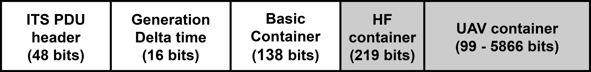
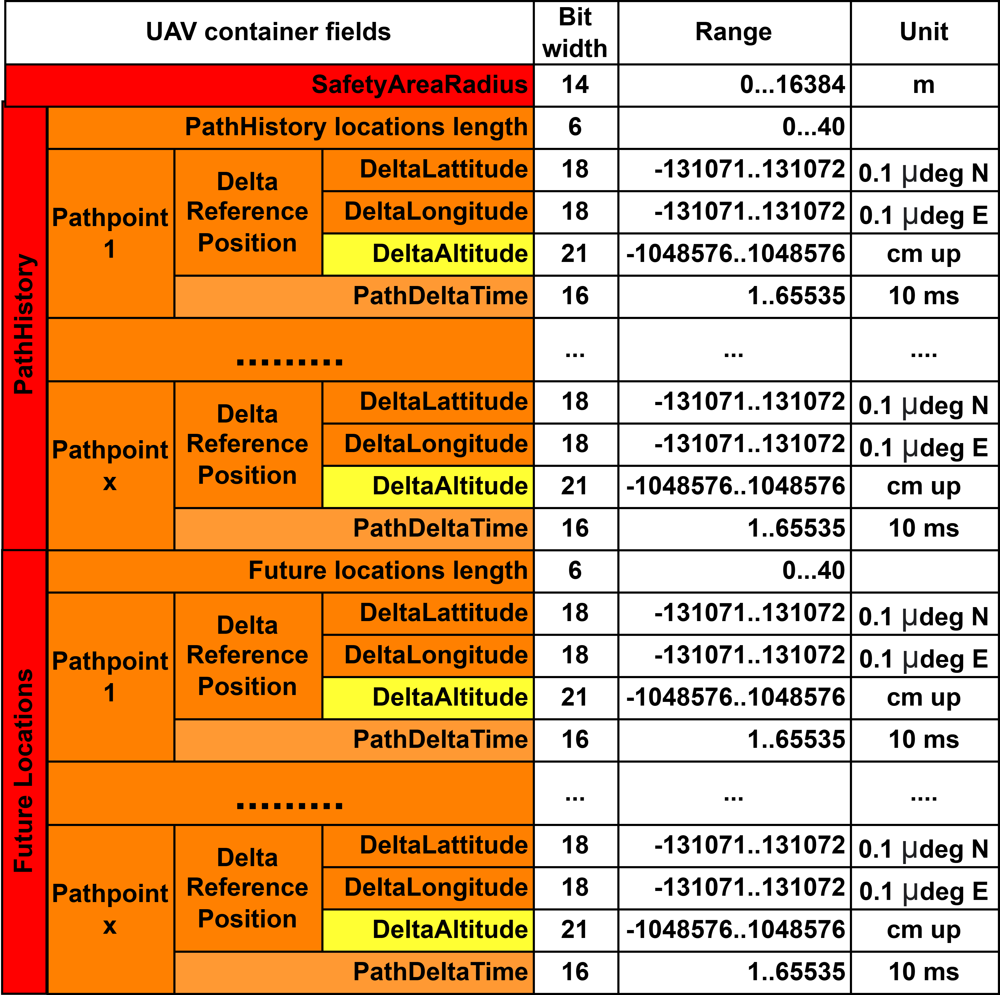
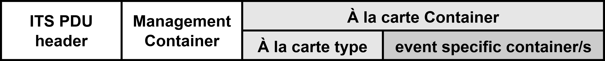

The CAM structure:

ITS PDU Header:

GenerationDeltaTime:

Basic Container:

High Frequency Container:

UAV Container

_____________________________________________________________________________________________
The DENM structure:

ITS PDU Header:

Management Container:

Å la carte Containers
    
    Refuel Container:
    
    
    
    Refuel Accept Container:
    
    

    Refuel Reject Container:
    
    